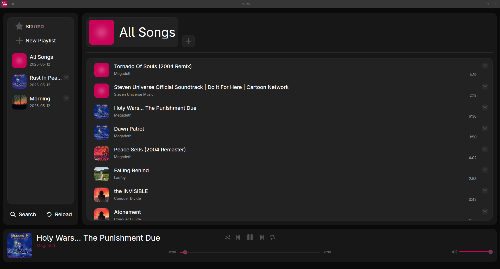

# Musy App
A modern, open-source offline music player and a free alternative to expensive streaming services.

Musy offers a sleek, user friendly interface that rivals both offline and online music players, giving you full control of your music library without subscriptions or hidden costs.

## First Time Use

- Open Musy.
- Click **Reload** to scan your device for music files.
- Enjoy your library!

## Features

- 🎶 **Playlists**: Create and manage custom playlists.
- ⭐ **Starred**: Save your most loved tracks for quick access.
- 🔀 **Shuffle Play**: Randomize your listening experience.
- 📁 **Local Library Support**: Works with your existing music files (MP3, FLAC, etc.).
- 🎧 **Background Playback**: Keep music playing while using other apps.
